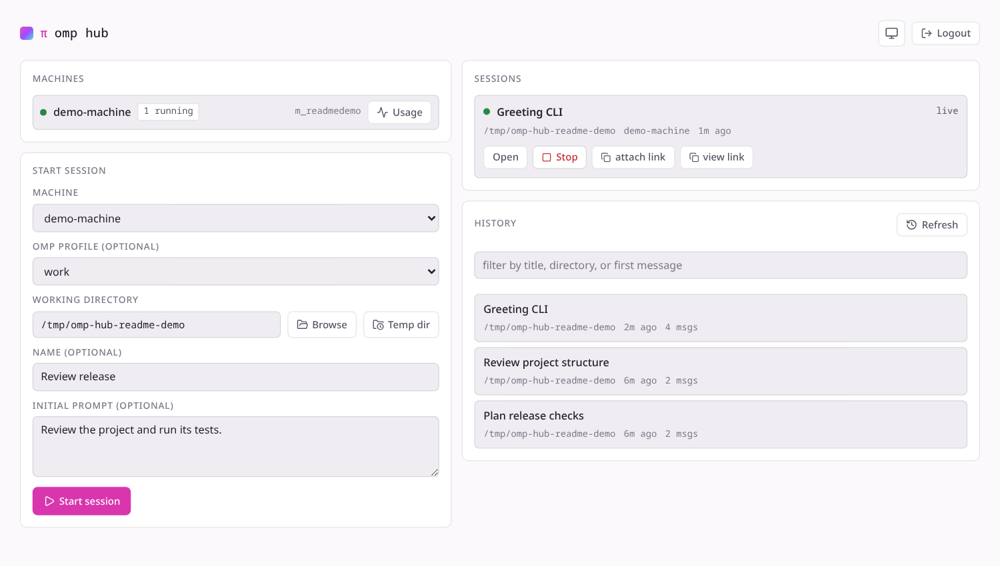
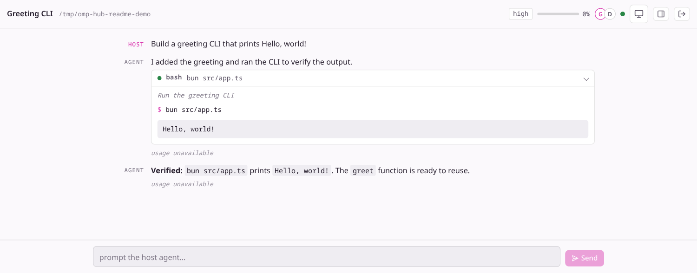
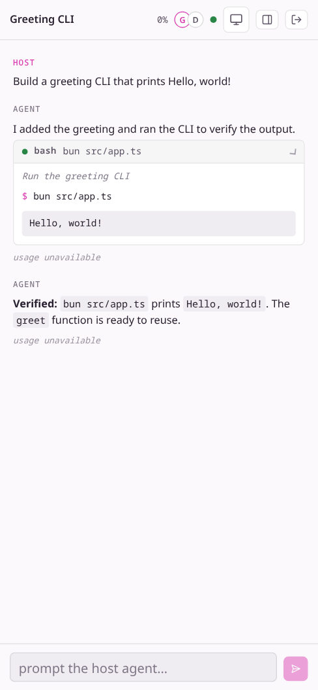

# omp-hub

Headless remote-control suite for [omp](https://github.com/can1357/oh-my-pi) agent sessions.

## Preview

**Manage machines and sessions in one place.** Pick a machine and profile, start or resume work,
and copy full or view-only links.



**Drive the live session from a browser.** Follow the transcript, expand tool output, and send prompts.



<details>
<summary>Mobile session view</summary>



</details>

These captures use an isolated demo machine and a sample transcript; no provider request or
personal session history was used.

## Components

| Package | Runs where | Purpose |
|---|---|---|
| `packages/hub` | a server (or Docker) | collab relay + machine/session registry + web UI host + wrapper control channel |
| `packages/agent` | every machine you want to drive | headless daemon: receives hub commands, spawns SDK agent sessions, hosts them via collab |
| `packages/web` | built into hub's static dist | browser UI (desktop + mobile): machine list, start/stop sessions, full live session control |

No local TUI/GUI is opened anywhere on the agent machines. All interaction happens in the browser
or by attaching a real omp client (`omp join "<link>"`) to a live session.

## Features

- Start sessions on connected machines (cwd, optional omp profile and initial prompt); list and
  resume sessions saved on an agent machine.
- **Full web operation** of a live session: streaming transcript, tool cards, prompt, interrupt,
  subagent panel (chat/kill/revive/transcript), host UI dialogs (select/editor) — the complete
  collab guest feature set, plus stop.
- **omp client attach**: copy the session's full or view-only collab link and `omp join` it from
  any terminal for the native TUI experience.
- **Responsive layout**: phone and desktop layouts share the upstream collab-web breakpoints.
- **Hub as one Docker container**: single port serves relay + API + web UI.
- **Web slash commands**: typing `/` in the composer opens a palette — `/model`, `/thinking`,
  `/rewind`, `/settings`, `/collab` (links), `/theme`, `/dump`, `/leave`, `/help`. Model/thinking changes run
  on the host through the hub→agent command channel; slash text is never sent to the LLM.
- Machine usage dashboard proxies the machine-local omp statistics endpoint.

## How it works (30 seconds)

```
┌────────────┐   WSS /agent (token)   ┌──────────────────────────────┐
│ omp-hub-   │ ───────────────────▶  │             HUB              │
│ agent (per │                        │  relay /r/:room  (WS)        │
│ machine)   │ ◀── start {cwd} ────  │  API   /api/*    (Bearer)    │
└────────────┘                       │  web   /*        (static UI) │
      │ spawns per session           └──────────────────────────────┘
      ▼                                          ▲            ▲
┌────────────┐  collab E2E frames  ┌─────────────┴───┐   ┌────┴─────────┐
│ session-   │ ──────────────────▶ │ browser (web UI)│   │ omp join     │
│ host (SDK) │ ◀── prompt/abort ── │ guest (full     │   │ (TUI attach) │
└────────────┘                     │ write link)     │   └──────────────┘
                                   └─────────────────┘
```

- All session payloads stay **AES-256-GCM end-to-end encrypted** between the session-host and the
  guest (browser or `omp join`); the hub relay is content-blind. The hub *registry* does hold the
  links (keys) for the sessions it manages — on this MVP the hub is a trusted party; deploy it
  accordingly.
- The wrapper never binds a port: it dials out to the hub. NAT-friendly.

## Quick start (local development, single machine)

Prereqs: Bun ≥ 1.3.14, Rust/Cargo and the native build toolchain, an omp auth store (`~/.omp`)
with a working provider (or provider API keys in the environment), and the source checkout of
the compatible omp SDK. The agent resolves SDK imports from a sibling `../oh-my-pi` checkout;
it is not a standalone npm package. From the `omp-hub` repository root, if you do not already
have that checkout:

```bash
git clone https://github.com/KamijoToma/oh-my-pi.git ../oh-my-pi
git -C ../oh-my-pi checkout 7ae76f8e4daca0c8f409f61bcd514260cd522365
bun --cwd=../oh-my-pi install --frozen-lockfile
bun --cwd=../oh-my-pi run build:native
mkdir -p /tmp/omp-hub-demo
```

This SDK revision is the one used for local verification. See [the agent README](packages/agent/README.md)
for the source mapping and deployment constraints.

```bash
# 1. hub demo (installs locked web deps, builds UI, serves relay + API + web on :8080)
cd packages/hub
HOST=127.0.0.1 HUB_TOKEN=dev-token bun run demo

# 2. wrapper agent (another shell, from the repository root)
cd packages/agent
HUB_TOKEN=dev-token bun run dev -- --hub ws://127.0.0.1:8080 --name dev-machine
```

Open `http://127.0.0.1:8080` in a browser, enter the local-only token `dev-token`, select
`dev-machine` and start a session with `cwd=/tmp/omp-hub-demo`. To attach a terminal client,
copy the **full** collab link from the session page and run `omp join "<paste full link here>"`.
Keep full links private: they grant write access to the session.

For type checking, run `bun install --frozen-lockfile && bun run typecheck` in each of
`packages/web`, `packages/hub`, and `packages/agent`. The agent check needs the sibling
`oh-my-pi` checkout and its installed dependencies. `bun run build` in `packages/web`
rebuilds the static UI without starting the hub.

## Docker (hub only)

For a local-only deployment, build the hub image and bind it to loopback:

```bash
docker build -f docker/Dockerfile -t omp-hub .
export HUB_TOKEN="$(openssl rand -hex 32)"
docker run --rm -p 127.0.0.1:8080:8080 -e HUB_TOKEN="$HUB_TOKEN" omp-hub
```

`docker compose -f docker/docker-compose.yml up --build` uses the exported `HUB_TOKEN` too.
Wrappers run directly on the machines being controlled (they need the local filesystem, shell,
and omp auth store); they are not included in this image.

For remote browser/agent access, use **HTTPS/WSS** (terminate TLS on the hub with
`HUB_TLS_CERT`/`HUB_TLS_KEY`, or at a reverse proxy and set `HUB_PUBLIC_URL=https://...`).
The browser requires a secure context for WebCrypto; non-local `ws://` collab links are rejected.
For a direct non-loopback hub, explicitly set `HOST=0.0.0.0` behind a firewall; Docker already
binds within its container, but the examples publish only on the host's loopback address.
Ensure the non-root container user can read mounted TLS certificates. See
[TLS / LAN notes](docs/architecture.md#tls--lan-notes-hard-constraints-from-upstream).

## Security and limits

`HUB_TOKEN` is a required shared bearer credential for the agent channel and HTTP API; an unset
or blank token prevents startup. The browser stores the token locally. Any authenticated
user can obtain a session's full write link, and the hub registry stores all session links and
keys. Session hosts run omp tools with headless auto-approval and have access to the agent
machine's files and provider credentials. Any token holder can browse the machine's recent omp
session history across projects (including paths, titles and first-message excerpts) and resume
saved sessions. Run the daemon under a dedicated OS account if personal history must stay private.
The relay `/r/` is unauthenticated and has no room quota or host-identity check: a holder of a
view link could claim the host role after a disconnect.

This is **not** a multi-tenant or public-internet service; restrict ingress to trusted users and
networks, and never publish tokens/links. State is in memory and live rooms are lost when the hub
restarts. See [the security model](docs/architecture.md#security-model-mvp).

## Docs

- [docs/architecture.md](docs/architecture.md) — components, topology, security model, design decisions
- [docs/protocol.md](docs/protocol.md) — wrapper↔hub control protocol, HTTP API, relay contract
- [docs/milestones.md](docs/milestones.md) — MVP phases and post-MVP roadmap
- [docs/e2e.md](docs/e2e.md) — manual end-to-end verification and known limitations

GitHub Actions runs frozen installs, typechecks and tests for all three packages, builds the web
UI and container image, and pins the external SDK revision used by the agent.

## License

[MIT](LICENSE). The vendored web client derives from
[`@oh-my-pi/collab-web`](https://github.com/can1357/oh-my-pi) (MIT); the original copyright
holders and permission notice are preserved in `LICENSE`.
Bundled third-party libraries keep their own licenses (including Lucide's ISC/Feather notices
and Marked's Markdown notice); the hub Docker image carries their full texts in `/app/licenses/`.
