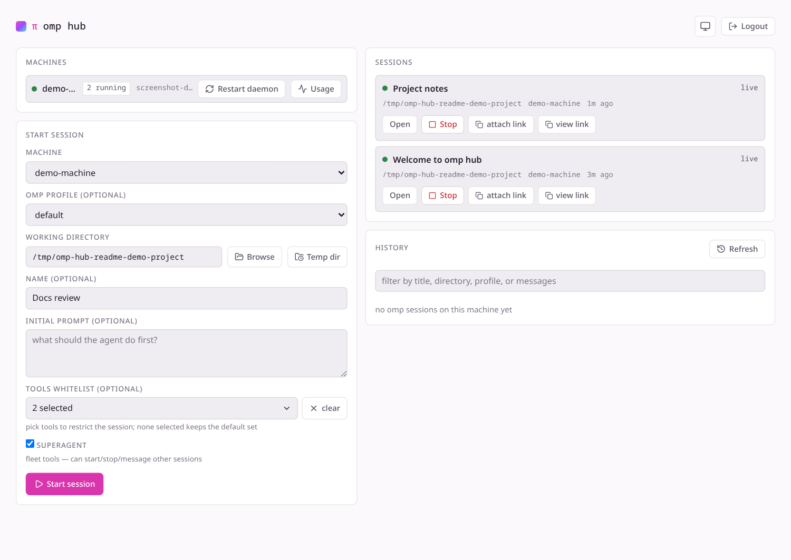
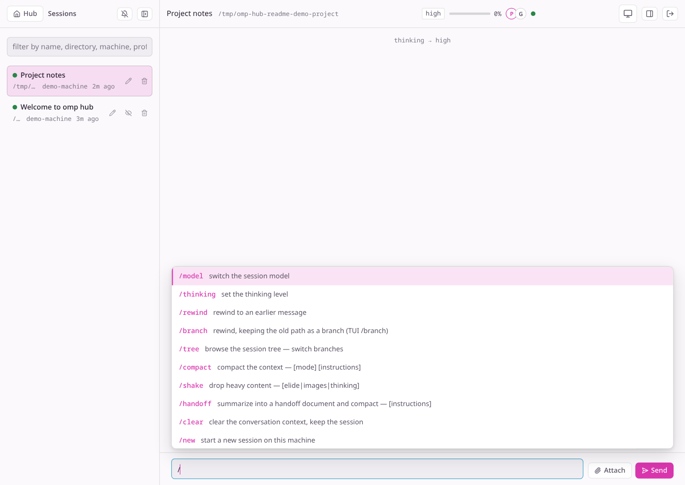
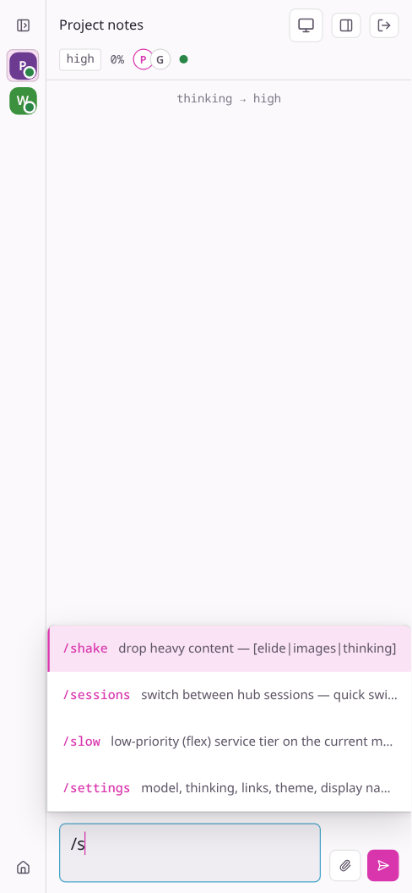

# omp-hub

[English](README.md) | 简体中文

在自己的机器上运行 [omp](https://github.com/can1357/oh-my-pi) 会话，通过浏览器集中管理。每台受控机器上的代理主动连接 Hub；Hub 提供控制台、加密会话中继和 Web 客户端。

## 功能预览

**集中查看机器与会话。** 控制台列出已连接机器和会话，并提供重启操作及可配置的新会话表单。



**在多个实时会话间切换。** 展开的侧栏列出演示会话，旁边展示会话状态栏和斜杠命令面板。



<details>
<summary>移动端会话界面</summary>



</details>

截图使用隔离的演示机器与空闲的合成会话；没有请求模型服务，也没有使用私人历史或凭据。

## 组件

| 目录 | 运行位置 | 职责 |
|---|---|---|
| `packages/hub` | 服务器或 Docker | 中继、机器／会话 API、Web UI 与代理控制通道 |
| `packages/agent` | 每台受控机器 | 只主动连接 Hub 的守护进程，托管相互隔离的 omp 会话 |
| `packages/web` | 由 Hub 提供服务 | 桌面与移动端浏览器界面 |

代理机器不会打开本地 TUI。通过浏览器操作，或用 `omp join "<完整控制或只读链接>"` 从终端加入。

## 主要功能

- **管理多个会话：** 在已连接机器上指定目录，可选配置档、名称和初始提示词；通过侧栏或
  切换器查看活动状态、切换实时会话，可选浏览器通知。可重命名、仅在当前浏览器隐藏、停止或
  从 Hub 列表移除会话（保留 omp 会话文件），并恢复已保存的对话。支持按元信息筛选；当前
  源码版本还支持搜索提示词／助手消息内容。
- **在浏览器中工作：** 实时查看转录和工具结果、发送或中断提示词、处理交互对话框、
  管理子智能体；完整控制和只读链接也可用于 omp 客户端接入。
- **控制智能体：** 切换模型、思考等级与角色分配；配置会话范围的高级设置与模式（计划、
  顾问、目标和循环），管理 MCP 服务器（配置变更在新会话生效）。启动时可用工具白名单
  限制可用工具，或开启 **superagent** 跨会话启动、停止与发送消息；未指定白名单则使用
  默认的全部工具。
- **维护机器与 Hub：** 查看机器用量，从控制台重启代理以加载新代码：代理会停止会话子进程，
  再按原会话 ID 从已保存的转录恢复。需认证的 Hub 重启 API 可利用 `hub-state.json`（实际
  Hub 进程的默认状态文件）交接机器／会话注册表。代理重连、实时会话宿主重建中继房间；
  房间和临时通知不持久化，重启期间会短暂中断。

## 工作原理（30 秒）

```text
┌────────────┐   WSS /agent (token)   ┌──────────────────────────────┐
│ omp-hub-   │ ───────────────────▶  │             HUB              │
│ agent (per │                        │  relay /r/:room  (WS)        │
│ machine)   │ ◀── start {cwd} ────  │  API   /api/*    (Bearer)    │
└────────────┘                       │  web   /*        (static UI) │
      │ spawns per session           └──────────────────────────────┘
      ▼                                          ▲            ▲
┌────────────┐  collab E2E frames  ┌─────────────┴───┐   ┌────┴─────────┐
│ session-   │ ──────────────────▶ │ browser (web UI)│   │ omp join     │
│ host (SDK) │ ◀── prompt/abort ── │ guest (full     │   │ (TUI attach) │
└────────────┘                     │ write link)     │   └──────────────┘
                                   └─────────────────┘
```

- 会话帧在宿主与浏览器或 `omp join` 之间使用 **AES-256-GCM 端到端加密**；中继只转发密文。但 Hub 注册表持有完整控制／只读链接及密钥，状态快照还会把这些链接写入磁盘；须保护 Hub 和快照。
- 代理只主动连接 Hub，受控机器无需开放入站端口。

## 从 GitHub Release 安装

Hub 和已发布的 `v0.9.1` 源码包可使用 Bun ≥ 1.3.14；当前源码**代理**的受限 SQL 会话查询进程要求 Bun ≥ 1.4.0，编译版原生代理自带运行时。代理机器还需要可用的 omp 模型凭据（`~/.omp/agent` 或提供商 API 密钥）。[已发布的版本](https://github.com/KamijoToma/omp-hub/releases)提供包含 Hub 源码、**已构建** Web UI、代理源码和第三方许可证的归档；不包含 `node_modules` 或 Docker 构建文件。以下使用已发布的 `v0.9.1` 资源。标签之后的新功能须从下文的源码仓库运行，直到下一次发布。

```bash
# 在 Hub 机器的任意目录开始：
mkdir -p "$HOME/omp-hub-release" && cd "$HOME/omp-hub-release"
umask 077  # 保护含会话链接的 hub-state.json
curl -fL -O https://github.com/KamijoToma/omp-hub/releases/download/v0.9.1/omp-hub-v0.9.1.tar.gz
curl -fL -O https://github.com/KamijoToma/omp-hub/releases/download/v0.9.1/SHA256SUMS.txt
sha256sum -c --ignore-missing SHA256SUMS.txt
tar -xzf omp-hub-v0.9.1.tar.gz
cd omp-hub
HUB_TOKEN=dev-token HOST=127.0.0.1 bun packages/hub/src/main.ts
```

在另一个终端、每台代理机器上，重复下载、校验与解包步骤（本机体验可复用刚解包的目录），然后执行：

```bash
cd "$HOME/omp-hub-release/omp-hub"
bun --cwd=packages/agent install --frozen-lockfile
mkdir -p /tmp/omp-hub-demo
HUB_TOKEN=dev-token bun packages/agent/src/main.ts --hub ws://127.0.0.1:8080 --name dev-machine
```

打开 `http://127.0.0.1:8080`，输入 `dev-token`，选择 `dev-machine`，以 `/tmp/omp-hub-demo` 为工作目录启动会话。`dev-token` 和 HTTP/WS **仅适用于单机回环地址**。远程部署要改用强共享令牌和 HTTPS/WSS：

```bash
# Hub 机器：从已解包目录运行，确保证书文件可读。
cd "$HOME/omp-hub-release/omp-hub"
HUB_TOKEN='<强共享密钥>' HOST=0.0.0.0 \
  HUB_TLS_CERT=/path/to/cert.pem HUB_TLS_KEY=/path/to/key.pem \
  bun packages/hub/src/main.ts
# 代理机器：同样从已解包目录运行，并先完成上文锁文件安装。
cd "$HOME/omp-hub-release/omp-hub"
HUB_TOKEN='<同一个强共享密钥>' \
  bun packages/agent/src/main.ts --hub wss://hub.example.com:8080 --name my-machine
```

替换示例密钥、证书路径与域名，并把 Hub 的入站访问限定在可信网络。也可在反向代理终止 TLS，并为 Hub 设置 `HUB_PUBLIC_URL=https://hub.example.com`，使生成的会话链接使用 WSS。远程浏览器的 WebCrypto 需要 HTTPS，非本机的 `ws://` 会话链接会被拒绝。完整控制链接具有写入权限，务必保密。代理的锁文件会安装针对当前平台预编译的 SDK 二进制文件，**无需相邻 SDK 源码仓库或 Rust 构建**。参见[代理说明](packages/agent/README.md)。

**Linux x64（glibc）** 的原生代理归档不需要 Bun。请在受控机器上下载，并将三个可执行文件与
`pi_natives.linux-x64-baseline.node` 放在同一目录；代理会从该目录启动隔离的会话宿主和统计进程：

```bash
mkdir -p "$HOME/omp-hub-agent" && cd "$HOME/omp-hub-agent"
curl -fL -O https://github.com/KamijoToma/omp-hub/releases/download/v0.9.1/omp-hub-agent-linux-x64-v0.9.1.tar.gz
curl -fL -O https://github.com/KamijoToma/omp-hub/releases/download/v0.9.1/SHA256SUMS.txt
sha256sum -c --ignore-missing SHA256SUMS.txt
tar -xzf omp-hub-agent-linux-x64-v0.9.1.tar.gz
HUB_TOKEN="<与 Hub 相同的密钥>" ./omp-hub-agent --hub wss://hub.example.com
```

原生代理不需要 Bun、npm 或源码仓库，但仍需机器上的 omp 凭据；`ws://` 只用于本机回环地址。

### 源码仓库（获取最新源码功能）

安装 Git 和 Bun 后，克隆源码仓库并在其根目录执行（Release 归档不包含 Web 源码或构建脚本）：

```bash
git clone https://github.com/KamijoToma/omp-hub.git
cd omp-hub
bun --cwd=packages/agent install --frozen-lockfile
mkdir -p /tmp/omp-hub-demo
umask 077  # 保护含会话链接的 hub-state.json
HUB_TOKEN=dev-token HOST=127.0.0.1 bun --cwd=packages/hub run demo
# 在另一个终端，也从仓库根目录执行：
HUB_TOKEN=dev-token bun --cwd=packages/agent run start -- --hub ws://127.0.0.1:8080 --name dev-machine
```

`demo` 按锁文件安装 Web 依赖、构建静态 UI 后启动 Hub；普通的 `bun --cwd=packages/hub run start` 则使用已有 Web 构建。要从终端接入，复制会话链接并执行 `omp join "<在此粘贴链接>"`。

## Docker（仅 Hub，需源码仓库）

从**仓库根目录**构建 Hub／Web 镜像，并只在宿主机回环地址发布端口：

```bash
docker build -f docker/Dockerfile -t omp-hub .
export HUB_TOKEN="$(openssl rand -hex 32)"
docker run --rm -p 127.0.0.1:8080:8080 -e HUB_TOKEN="$HUB_TOKEN" omp-hub
```

`docker compose -f docker/docker-compose.yml up --build` 同样使用已导出的令牌。镜像不包含代理；在每台受控机器上单独安装并运行。构建镜像需要仓库的 Web 源码和 `docker/`，**Release 归档没有这些文件**。远程访问请按上文使用 HTTPS/WSS；容器内部监听所有地址，但此示例只向宿主机回环地址发布端口。挂载的 TLS 密钥须可由非 root 容器用户读取。容器默认文件系统不是持久可写的状态目录；若要跨容器重启恢复，请挂载私有的可写目录，并将 `HUB_STATE_FILE` 指向该目录。详情见[局域网与 TLS 约束（英文）](docs/architecture.md#tls--lan-notes-hard-constraints-from-upstream)。

## 安全模型与限制

`HUB_TOKEN` 用于代理连接和 HTTP API；未设置或为空时 Hub 拒绝启动。浏览器将其保存在本地。令牌持有者可以获取会话的完整写入链接、查看机器上跨项目的近期 omp 会话历史（含路径、标题及首条消息摘要），并恢复保存的会话。无界面宿主会自动批准 omp 工具调用，能访问代理机器的文件与模型凭据；工具白名单只限制这一次会话的工具，不限制持有令牌的人下次启动的会话。superagent 还能操作其他会话。若需隔离本机历史或凭据，请用独立系统账户运行代理。

`/r/` 中继不验证访客身份、限制房间数或校验宿主身份：持有只读链接的人也可能在宿主断线后占用宿主位置。Hub 注册表和 `hub-state.json` 快照含会话密钥，必须保护状态文件、令牌和链接。实际 Hub 入口会持久化机器／会话注册表用于重启恢复，但实时中继连接和临时通知不会跨进程保存；代理与访客重连后可恢复实时房间，不保证完全无中断。**这不是面向不可信用户的多租户或公网服务**；只向可信用户与网络开放。详情见[安全模型（英文）](docs/architecture.md#security-model-mvp)。

## 文档

- [架构（英文）](docs/architecture.md)：组件、部署拓扑、安全模型和设计取舍。
- [协议（英文）](docs/protocol.md)：代理与 Hub 的控制协议、HTTP API 和中继约定。
- [里程碑（英文）](docs/milestones.md)：MVP 阶段与后续计划。
- [端到端验证记录（英文）](docs/e2e.md)：人工验证步骤和已知限制。

GitHub Actions 按锁文件安装三个包的依赖、运行类型检查及 Bun 测试，再构建 Web UI、仅包含 Hub 的容器与 Linux x64 原生代理。每次推送都会实测原生代理的会话、具名 profile 统计与自重启；符合条件的标签在下载 CI 产物后再次验证，将源码与原生归档及 `SHA256SUMS.txt` 发布至 GitHub Release。发布资源对应标签时的代码，不包含未发布的源码更改；该工作流不会发布 npm 包或 Docker 镜像。

## 许可证

本项目采用 [MIT 许可证](LICENSE)。Web 客户端包含源自
[`@oh-my-pi/collab-web`](https://github.com/can1357/oh-my-pi) 的代码（MIT）；原作者的版权声明
和授权文本保留在 `LICENSE`。构建进 Web UI 的第三方库仍适用其各自的许可证（包括 Lucide 的
ISC／Feather 声明和 Marked 的 Markdown 声明）；Hub 的 Docker 镜像在 `/app/licenses/` 中附带
完整的第三方授权文本，GitHub Release 归档则在 `licenses/` 中附带。
